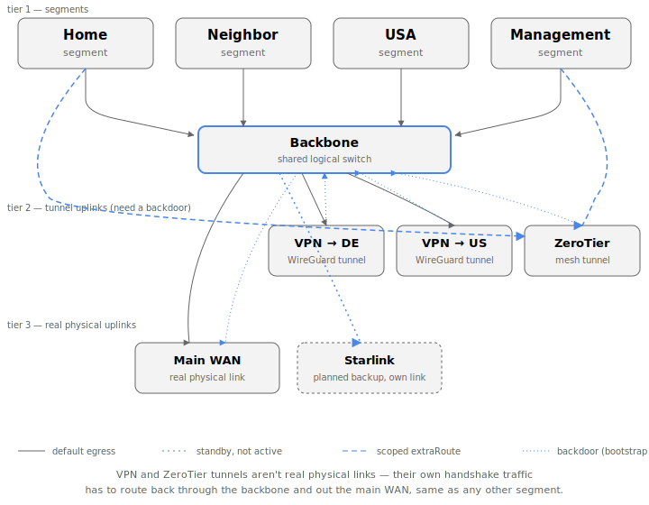
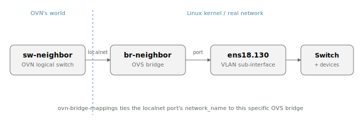
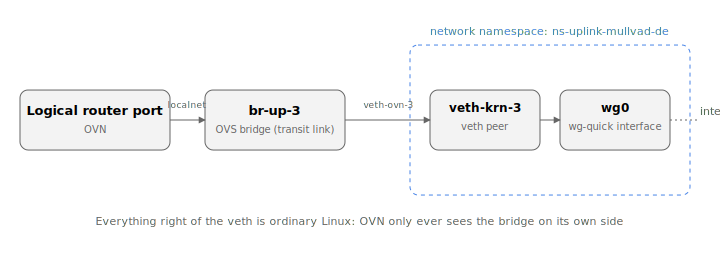

# Bridging OVN into a physical home network (or: how "what is OVS?" led here)

Code: [github.com/mabels/ovn-fabric](https://github.com/mabels/ovn-fabric)

This started as a completely different problem. I run Home Assistant,
among other things, on Proxmox — and mDNS/SSDP-style discovery cares a lot
about proper broadcast/multicast handling. Put a pile of VMs behind a
shared Linux bridge with VLANs bolted on top and discovery gets flaky in
exactly the way that makes smart-home devices miserable to debug. My fix
for that had been SR-IOV: pass a virtual function straight through to each
VM from an Intel NIC that supports it, so each one gets a genuinely
isolated L2 path instead of sharing a software bridge.

That works, until it doesn't. Not every NIC does SR-IOV. Allocating and
tracking VFs by hand across a growing pile of VMs gets old fast. And if
your router itself runs as a VM on the same Proxmox host — OPNsense, in my
case — FreeBSD's driver support for VF devices is shaky enough to make
that specific combination its own recurring headache.

So I looked at other routers. I've got MikroTik gear in a few shapes —
hardware, CHR, x86 — but the licensing is inflexible in ways that make it
awkward to actually rely on for something like this. OPNsense and VyOS are
both solid, but they — and MikroTik — all share the same underlying
pattern: real configuration, but no single central description of the
whole topology, and no clean way to move that configuration from one
router to another or spin up a backup router from it. Every one of them
gives you one router's config, not a network's. None of them speak
ZeroTier or Tailscale natively either, at least not without bolting on a
package or a container — mesh-VPN-as-an-uplink just isn't a concept any of
these appliances have. (DNS is its own story, for another time.)

At that point I decided not to take one more incremental step, but ten at
once. Chasing the actual SR-IOV/multicast problem led me to Open vSwitch —
get the L2 switching right in software and the whole VF-allocation
workaround stops being necessary. Somewhere in the middle of asking Claude
"what is OVS, actually" I learned OVN existed as the SDN control-plane
layer on top of it — and, with a lot of back-and-forth with Claude along
the way, ended up building [ovn-fabric](https://github.com/mabels/ovn-fabric),
which has since fully proven itself as a replacement for the old router
setup.

The one piece of the old design I kept: one router, one single physical
uplink, talking down to properly managed L2 switches. Everything else —
segmentation, VPN egress choices, failover — moved into ovn-fabric. And
OVN, it turns out, was built to solve a completely different problem than
mine: giving VMs and Kubernetes pods a network that behaves consistently
no matter which physical host they land on. Everything about its design
assumes that shape — lots of virtual endpoints, one or two narrow doors to
the physical world. Point it at an actual home network instead — real
VLANs, real physical NICs, a real WireGuard tunnel that has to run
somewhere — and that assumption breaks immediately. Most of the
interesting engineering in ovn-fabric is exactly there: at the seams
between OVN's virtual world and the real Linux kernel underneath it.

Here's the shape of the result, for reference while reading the rest of
this:



## A short primer on how OVN actually works

Skip this if you already know it. OVN's whole model lives outside the
Linux kernel. You declare logical switches, routers, and ports as rows in
a database (`ovn-nbctl`); `ovn-northd` compiles that into flow rules; a
per-host agent (`ovn-controller`) programs those flows into Open vSwitch.
None of it is a kernel networking concept — there's no interface, no
route, no ARP table that `ip`, a routing daemon, or `radvd` can see. A
logical router port's address exists purely as OVS flow rules; ask `ip
addr show` and there's nothing there.

It works the other way too: OVN has zero visibility into real Linux
interfaces unless you explicitly hand it one, via a `localnet` port or a
`veth`. IP addresses on one side of that divide simply don't exist on the
other side. Every "bridge" described below is a deliberate, narrow
crossing of that gap — and that gap is exactly where a home network, with
its real VLANs, real physical uplinks, and a WireGuard tunnel that has to
run *somewhere*, doesn't fit OVN's original cloud-shaped assumptions.

## Bridge one: a logical switch and an actual VLAN

OVN does have a primitive for touching the physical world: a
`localnet` port. Give a logical switch a port of type `localnet`, tell it
a `network_name`, and set `ovn-bridge-mappings` on the chassis so that name
resolves to a real OVS bridge — one that has an actual Linux interface
added to it as a port. From that point on, `ovn-controller` treats
anything hitting that logical switch's "unknown" side as coming from —
and going to — that real bridge.



For one VLAN segment, that's three physical-side commands and a handful of
logical ones:

```sh
ip link add link ens18 name ens18.130 type vlan id 130
ovs-vsctl add-br br-neighbor
ovs-vsctl add-port br-neighbor ens18.130
ovs-vsctl set open_vswitch . external-ids:ovn-bridge-mappings=seg-neighbor:br-neighbor

ovn-nbctl lsp-add sw-neighbor lsp-neighbor-localnet
ovn-nbctl lsp-set-type lsp-neighbor-localnet localnet
ovn-nbctl lsp-set-options lsp-neighbor-localnet network_name=seg-neighbor
```

Fine, once. A typical OVN deployment does this exactly once — the single
provider network a cloud's gateway nodes need. A home network wants this
*per segment*: home, guest, a neighbor's isolated VLAN, a management/DMZ
network, each with its own VLAN tag, its own bridge, its own localnet port,
its own logical router. Multiply that hand-typed block by four (or by
however many segments your network actually has) and you've got the
exact kind of repetitive, error-prone, drift-prone config that's the whole
reason infra-as-code exists everywhere else. `ovn-fabric` just applies that
idea here: you declare a segment once —

```ts
net.segment("neighbor", segmentVlan({
  id: "130",
  vlanParent: "ens18",
  uplink: new ManualUplink(someUplink),
  gatewaySuffix: 1,
  host,
}));
```

— and it generates all of the above, correctly, every time, for every
segment, idempotently (`ip link show ... || ip link add ...`,
`--may-exist`, `--if-exists`), so re-running the generated script or
rebooting the host never duplicates or drifts from what's declared.

## Bridge two: OVN, a network namespace, and WireGuard

Quick detour, since the rest of this section leans on it: a Linux **network
namespace** is a completely separate copy of the kernel's network stack —
its own interfaces, its own routing table, its own `iptables` rules, its
own ARP/neighbor tables. `ip netns add ns-foo` creates one; by default it
starts empty, with nothing but a loopback interface, totally isolated from
whatever's running in the "default" namespace the host normally lives in.
You move a real interface into it with `ip link set some-if netns ns-foo`,
and run anything inside it with `ip netns exec ns-foo <command>`. Two
namespaces can reuse the exact same IP ranges without conflict, because as
far as either one is concerned, the other doesn't exist — nothing crosses
that boundary unless you explicitly wire something across it, typically a
**veth pair**: a virtual point-to-point cable with one end living in each
namespace.

That's the whole trick behind bridging OVN to something like WireGuard: it
doesn't teach OVN anything new, it just builds a small, ordinary Linux
namespace next to it and connects the two with a veth, the same way you'd
connect any two separate machines.

The VLAN bridge above is OVN talking to something the kernel already
understands natively — a plain L2 interface. WireGuard is a different
problem entirely: there is no `Logical_Router_Port` type for it, no
southbound concept of a tunnel OVN itself terminates. OVN's only two
building blocks for reaching the outside world are "encapsulated tunnel to
another chassis" and "localnet port to a real L2 segment." Neither of
those *is* a WireGuard tunnel. So `ovn-fabric` doesn't try to teach OVN
about WireGuard at all — it builds a small, real Linux detour instead, and
hands the result back to OVN as if it were just another localnet segment.



The shape is: a tiny **transit network** — a /28 or so — with one leg
inside OVN (a logical switch + logical router port, same localnet
primitive as above, just pointed at a throwaway bridge instead of a real
VLAN) and the other leg landing on a `veth` pair whose far end is moved
into a dedicated network namespace:

```sh
ovs-vsctl add-br br-up-3                      # OVN's side of the transit link
ip netns add ns-uplink-mullvad-de
ip link add veth-ovn-3 type veth peer name veth-krn-3
ovs-vsctl add-port br-up-3 veth-ovn-3
ip link set veth-krn-3 netns ns-uplink-mullvad-de
```

Inside that namespace lives a completely ordinary, `wg-quick`-managed
WireGuard interface, doing real kernel-level crypto against a real peer,
with `iptables`/`ip6tables` MASQUERADE rules handling NAT — none of it
OVN's concern. The namespace's own default route goes out through
WireGuard; its transit-link address is reachable from OVN through the veth
pair. From the logical router's point of view on the OVN side, this
uplink looks *exactly* like the VLAN bridge from the previous section: a
localnet port to a small bridge, a logical router port with an address on
it, a default route pointed at whatever's on the other end. It has no idea
there's a WireGuard tunnel, a network namespace, or a `veth` pair back
there — and that's the point. The round trip is: **OVN logical router →
transit link → veth → network namespace → real WireGuard interface →
internet**, and back.

The genuinely useful part is that this pattern is generic, not
WireGuard-specific. A plain physical WAN uplink is the same shape with a
real NIC standing in for the WireGuard interface. A ZeroTier-backed uplink
(join a mesh network, again a userspace daemon producing a real kernel
interface) is the same shape again. Anything that's a real Linux network
feature OVN doesn't natively speak — a VPN client, an overlay mesh, a
future WireGuard-over-QUIC thing nobody's invented yet — plugs into OVN the
same way: give it its own namespace, its own veth-connected transit link,
and let OVN treat the far end as just another uplink to route traffic
toward. One `uplinkWireguard(...)` / `uplinkZerotier(...)` factory call is
all a segment's config needs to know about; the namespace, the veth pair,
the transit addressing, and the idempotent re-apply logic are all
generated, every time, the same way.

One wrinkle worth naming: a fresh tunnel's own handshake and keepalive
traffic needs *some* path to the real internet before the tunnel exists —
it can't bootstrap over itself. Every VPN-shaped uplink can declare a
`backdoor` that borrows another, already-working uplink's egress for
exactly that bootstrap traffic, without becoming that segment's actual
default route. Same idea as the transit-link pattern above, just aimed at
solving the chicken-and-egg problem of bringing the tunnel up in the first
place.

## What this buys you

None of this complexity is visible from `topology.ts`. A segment doesn't
know or care whether its uplink is a VLAN, a physical NIC, or a namespace
with WireGuard humming away inside it — that's entirely the generator's
job to resolve and wire up correctly, every time, from one declared
source of truth. Switching a segment from its main WAN to a VPN tunnel, or
to a standby Starlink dish sitting there as backup, is a one-line
`.switchTo(...)` change — regenerate, diff, apply. Decommissioning an old
hardware router segment by segment is a reviewable diff against what's
currently installed, not a one-shot leap of faith. And it's all idempotent
enough that a reboot, or re-running the same script twice, never
duplicates a bridge, a namespace, or a route.

## Trying this yourself, cheaply

You don't need spare production hardware to poke at any of this — OVS and
OVN are both plain portable C, and Debian/Ubuntu ship `openvswitch-switch`,
`ovn-central`, `ovn-host`, and `ovn-common` as native arm64 packages, so a
spare Raspberry Pi (64-bit OS — Pi 4 or 5) is a perfectly good, disposable
place to try a segment or an uplink before touching anything real.

One thing worth checking before you commit to it: the stock Raspberry Pi
kernel has, at various points, not shipped the `geneve` kernel module OVS
needs for inter-chassis tunnels — worth a quick `modprobe openvswitch &&
modprobe geneve` on whatever image you pick before assuming it'll just
work. If either one's missing, that's a kernel/distro gap, not anything
architecture-specific to ARM.

## What's next

Uplink switching today is manual — `.switchTo(...)`, regenerate, apply.
The obvious next step is automatic failover: something watching uplink
health and flipping that selector on its own when voda-avm (or whichever
uplink a segment depends on) actually goes down, rather than waiting for a
human to notice.

The other direction is active/backup HA for the router itself, VRRP-style
— and OVN already half-has this: `HA_Chassis_Group` lets a distributed
gateway port declare a priority-ordered list of candidate chassis, so a
second box can take over the same virtual IP/MAC if the first one dies.
`ovn-fabric` only ever declares one chassis per port today; teaching it to
declare more is mostly extending an existing factory rather than building
something new.

The one I actually want most, though, is BGP. Every backbone route,
every scoped `extraRoute`, every uplink's default route in `ovn-fabric`
today is static — declared once, compiled into a fixed set of
`lr-route-add` calls. OVN already has the beginnings of a real answer to
that: dynamic routing support (`dynamic-routing-advertise` and friends) for
advertising and learning routes via BGP instead of hand-declaring them.
Wiring that up properly would fold uplink failover, VRRP-style HA, and the
whole tangle of static backbone routing into one thing routing protocols
already know how to do well — and let the network figure out its own
shape instead of needing to be told.

`ovn-fabric` is Apache-2.0, published on [npm/JSR as
`@adviser/ovn-fabric`](https://github.com/mabels/ovn-fabric), with a full
quickstart in the README.
